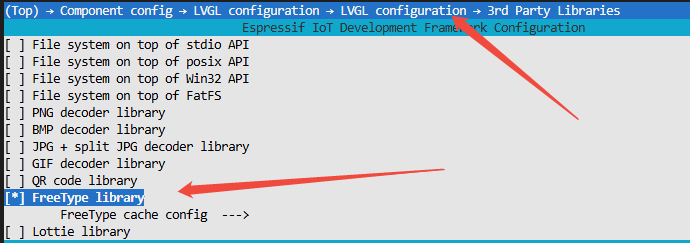
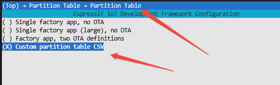

# 【lvgl-freetype】Usage Guide
## 1.Menuconfig Configuration
### 1.1.LV_USE_FREETYPE
- To use Freetype, you need to enable the LV_USE_FREETYPE option in menuconfig

### 1.2.Partition Table Configuration
- Font files are relatively large, and the default partition table does not allocate enough space. A custom partition table is required.

## 2.IDF Version
- This example requires ESP-IDF v5.1
